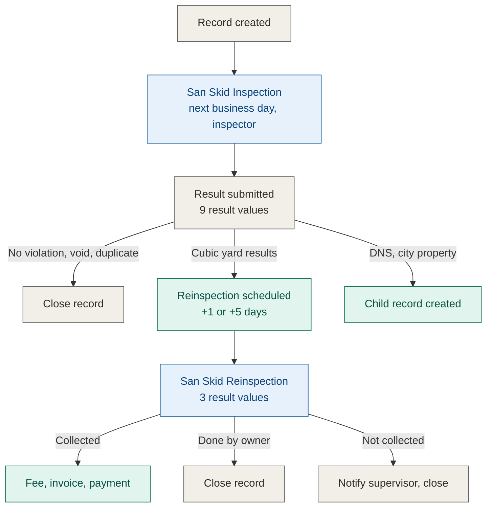

# Inspection lifecycle — Skid Violation

Generated from Tables A + B. See [RATIONALE.md](./RATIONALE.md) for why the reinspection
is drawn as a second node rather than a loop back to the first.

```mermaid
flowchart TD
  A[Record created] --> B["San Skid Inspection<br/>next business day, inspector"]
  B --> C["Result submitted<br/>9 result values"]
  C -->|No violation, void, duplicate| D[Close record]
  C -->|Cubic yard results| E["Reinspection scheduled<br/>+1 or +5 days"]
  C -->|DNS, city property| F[Child record created]
  E --> G["San Skid Reinspection<br/>3 result values"]
  G -->|Collected| H["Fee, invoice, payment"]
  G -->|Done by owner| I[Close record]
  G -->|Not collected| J["Notify supervisor, close"]

  classDef hook fill:#E6F1FB,stroke:#185FA5,color:#0C447C
  classDef effect fill:#E1F5EE,stroke:#0F6E56,color:#085041
  classDef terminal fill:#F1EFE8,stroke:#5F5E5A,color:#2C2C2A
  class B,G hook
  class E,F,H effect
  class A,C,D,I,J terminal
```
